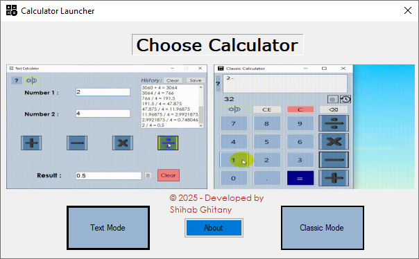
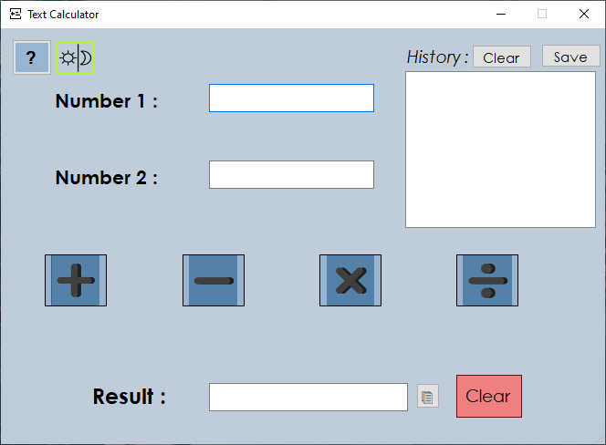
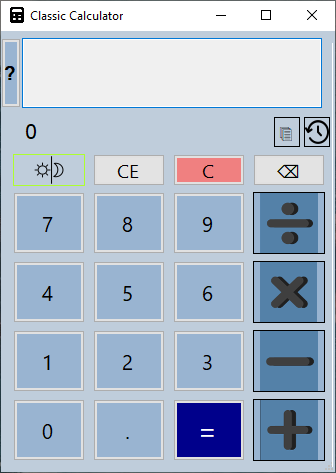

# multi-mode-calculator-c#

**multi-mode-calculator** is a versatile desktop calculator built with C# Windows Forms, offering multiple calculation modes, keyboard support, and history management.

## Features  

- Perform standard arithmetic operations: addition, subtraction, multiplication, division.  
- Two modes of calculation:  
  - **Classic Mode**: Single-line input for quick calculations.  
  - **Text Mode**: Separate inputs for two numbers, with continuous calculation support.  
- Keyboard shortcuts for faster input and operation.  
- Maintain history of calculations with click-to-copy functionality.  
- Save history to a text file.  
- Toggle between Dark and Light modes for better visibility.  

## Usage  
1. Choose your preferred mode: **Classic** or **Text**.  
2. Enter numbers and operations using buttons or keyboard shortcuts.  
3. Copy results or save history as needed.  
4. Expand history panel if you want to view past calculations.  

## Keyboard Shortcuts  
- `Escape` : Clear all inputs.  
- `C`      : Clear entry.  
- `Ctrl + C`: Copy result.  
- `Enter`  : Calculate.  
- `NumPad 0-9 / Top Row 0-9`: Enter numbers.  
- `+ - * /` : Arithmetic operations.  

## Screenshots: 
------------

Launcher Screen:

Text Calculator:

Classic Calculator:

## Developer  
- GitHub: [https://github.com/Shehab-Ghitany](https://github.com/Shehab-Ghitany)  
- LinkedIn: [https://www.linkedin.com/in/shehab-ghitany/](https://www.linkedin.com/in/shehab-ghitany/)
